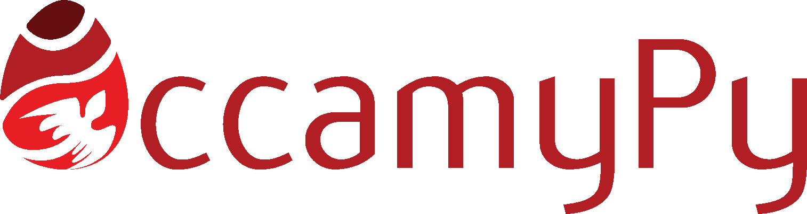

# OccamyPy: an object-oriented optimization framework for small- and large-scale problems

We present an object-oriented optimization framework that can be employed to solve
small- and large-scale problems based on the concept of vectors and operators.
By using such a strategy, we implement different iterative optimization algorithms
that can be used in combination with architecture-independent vectors and operators,
allowing the minimization of single-machine or cluster-based problems with a unique codebase.
We implement a Python library following the described structure with a user-friendly interface.
We demonstrate its flexibility and scalability on multiple inverse problems,
where convex and non-convex objective functions are optimized with different iterative algorithms.

### Installation
Preferred way is through Python Package Index:
```bash
pip install occamypy
```
In order to have Cupy-based vectors and operators, you should install also [Cupy](https://docs.cupy.dev/en/stable/install.html#install-cupy) and [cuSIGNAL](https://github.com/rapidsai/cusignal#installation).
They are not included in this installation as they are dependent on the target CUDA device and compiler.

As this library strongly relies on Numpy, we suggest installing OccamyPy in a conda environment like [this](./envs/env.yml).

### History
This library was initially developed at
[Stanford Exploration Project](http://zapad.stanford.edu/ettore88/python-solver)
for solving large scale seismic problems.
Inspired by Equinor's [PyLops](https://github.com/equinor/pylops)
we publish this library as our contribution to scientific community.

## How it works
This framework allows for the definition of linear and non-linear mapping functions that
operate on abstract vector objects that can be defined to use
heterogeneous computational resources, from personal laptops to HPC environments.

- **vector** class: this is the building block for handling data. It contains the required
mathematical operations such as norm, scaling, dot-product, sum, point-wise multiplication.
These methods can be implemented using existing libraries (e.g., Numpy, Cupy, PyTorch) or
user-defined ones (e.g., [SEPLib](http://sepwww.stanford.edu/doku.php?id=sep:software:seplib)).
See the [`vector`](./occamypy/vector) subpackage for details and implementations.

- **operator** class: a mapping function between a `domain` vector and a `range` vector.
It  can be linear and non-linear.
Linear operators require the definition of both the forward and adjoint functions;
non-linear operators require the forward mapping and its Jacobian operator.
See the [`operator`](./occamypy/operator) subpackage for details and implementations.

- **problem** class: it represents the objective function related to  an optimization problem.
Defined upon operators (e.g., modeling and regularization) and vectors (observed data, priors).
It contains the methods for objective function and gradient computation, as our solvers are mainly gradient based.
See the [`problem`](./occamypy/problem) subpackage for details and implementations.

- **solver** class: it aims at finding the solution to a problem by employing methods
defined within the vector, operator and problem classes.
Additionally, it allows to restart an optimization method from an intermetdiate result
written as serialized objects on permanent computer memory.
We have a number of linear and nonlinear solver, along with some stepper algorithms.
See the [`solver`](./occamypy/solver) subpackage for details and implementations.

### Features at a glance

| vector engines | operators | problems | solvers |
|-|-|-|-|
| numpy | linear      | least squares                   | Conjugate Gradient           |
| cupy  | nonlinear   | symmetric least squares         | Steepest Descent             |
| torch | distributed | L2-reg least squares            | LSQR                         |
|       |             | LASSO                           | symmetric Conjugate Gradient |
|       |             | generalized LASSO               | nonlinear Conjugate Gradient |
|       |             | nonlinear least squares         | L-BFGS                       |
|       |             | L2-reg nonlinear least squares  | L-BFGS-B                     |
|       |             | regularized Variable Projection | Truncated Newton             |
|       |             |                                 | Markov Chain Monte Carlo     |
|       |             |                                 | ISTA and Fast-ISTA           |
|       |             |                                 | ISTC (ISTA with cooling)     |
|       |             |                                 | Split-Bregman                |

### Scalability
The main objective of the described framework and implemented library is to solve large-scale inverse problems.
Any vector and operator can be split into blocks to be distributed to multiple nodes.
This is achieved via custom [Dask](https://dask.org/) vector and operator classes.
See the [`dask`](./occamypy/dask) subpackage for details and implementations.

### Tutorials
We provide some [tutorials](./tutorials) that demonstrate the flexibility of occamypy.
Please refer to them as a good starting point for developing your own code.
If you have a good application example, contact us! We will be happy to see OccamyPy in action.

Check out the [tutorial](https://curvenote.com/@swung/transform-2022-occamypy-an-oo-optimizaton-library/overview) we gave at SWUNG's Transform 2022!

### Contributing
Follow the following instructions and read carefully the [CONTRIBUTING](CONTRIBUTING.md) file before getting started.

### Authors
 - [Ettore Biondi](https://github.com/biondiettore)
 - [Guillame Barnier](https://github.com/gbarnier)
 - [Robert Clapp](http://zapad.stanford.edu/bob)
 - [Francesco Picetti](https://github.com/fpicetti)
 - [Stuart Farris](http://zapad.stanford.edu/sfarris)

### Citation
```
@article{biondi2021object,
  title = {An object-oriented optimization framework for large-scale inverse problems},
  author = {Ettore Biondi and Guillaume Barnier and Robert G. Clapp and Francesco Picetti and Stuart Farris},
  journal = {Computers & Geosciences},
  volume = {154},
  pages = {104790},
  year = {2021},
  doi = {https://doi.org/10.1016/j.cageo.2021.104790},
}
```
